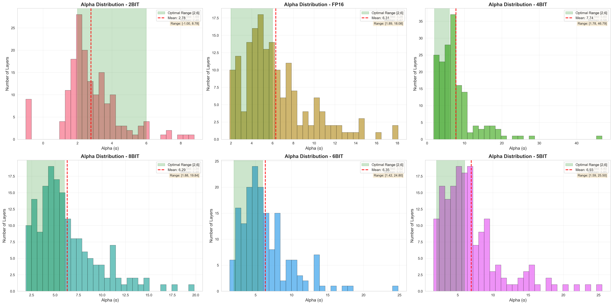
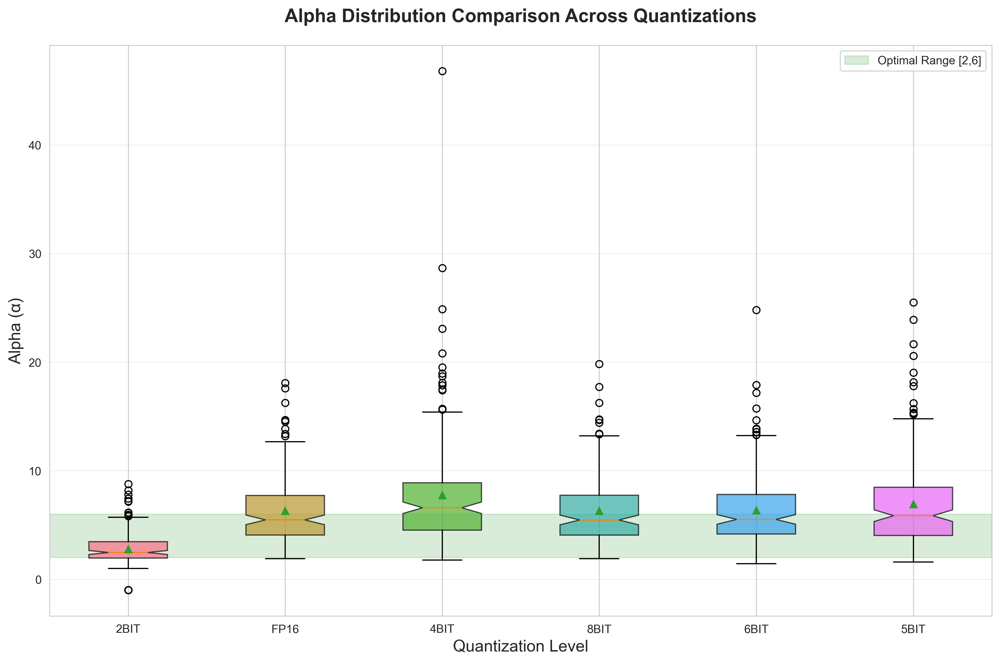
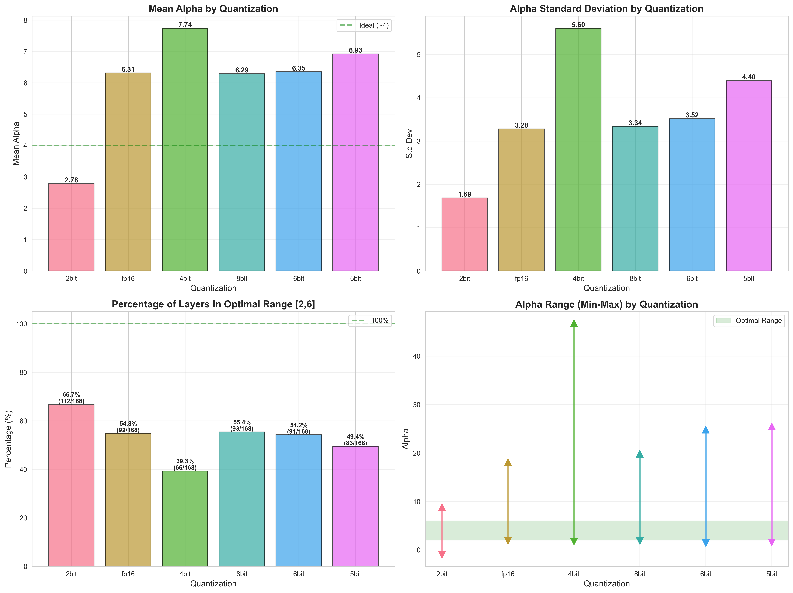
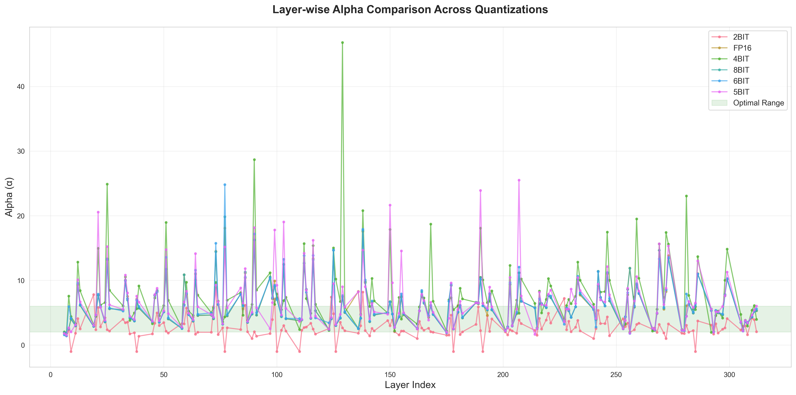
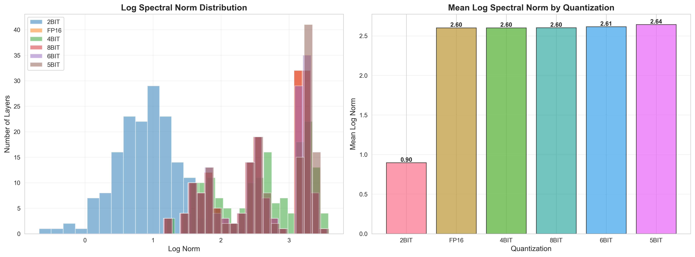

# WeightWatcher Quantization Analysis

Analyzes how quantization affects neural network quality using [WeightWatcher](https://weightwatcher.ai/) and Heavy-Tailed Self-Regularization (HTSR) theory. Tests 6 quantization levels (FP16 → 2-bit) to measure quality degradation without needing training data.

## 🎯 Key Results

Tested on **Qwen2.5-0.5B-Instruct** (168 layers):

| Quantization | Alpha Mean | Change | Correlation | Optimal Layers |
|--------------|------------|--------|-------------|----------------|
| **FP16** | 6.312 | baseline | 1.000 | 92/168 (54.8%) |
| **8-bit** | 6.294 | -0.30% ✅ | 0.988 | 93/168 (55.4%) |
| **6-bit** | 6.352 | +0.63% ✅ | 0.940 | 91/168 (54.2%) |
| **5-bit** | 6.926 | +9.72% ⚠️ | 0.775 | 83/168 (49.4%) |
| **4-bit** | 7.738 | +22.58% ⚠️ | 0.591 | 66/168 (39.3%) |
| **2-bit** | 2.783 | -55.91% 💀 | 0.238 | 48/168 corrupted |

**Key Findings:**
- **8-bit & 6-bit**: Essentially lossless (<1% degradation)
- **5-bit**: Quality degradation begins (+9.72%)
- **4-bit**: Significant quality loss (+22.58%)
- **2-bit**: Catastrophic failure (48 layers with α < 2)

**Recommendation**: Use 6-bit or 8-bit for production deployment.

**Note**: Uses naive symmetric quantization. Production methods (GGUF K-quants, MLX) would show less degradation.

## 📊 Visualizations

### Alpha Distributions


### Comparative Analysis
<table>
<tr>
<td width="50%">


</td>
<td width="50%">


</td>
</tr>
</table>

### Layer-wise & Spectral Analysis
<table>
<tr>
<td width="50%">


</td>
<td width="50%">


</td>
</tr>
</table>

## 🚀 Quick Start

```bash
# Setup
./setup.sh

# Run analysis (all 6 quantization levels, ~30 minutes)
./run_analysis.sh --quantizations fp16 8bit 6bit 5bit 4bit 2bit

# Or test a different model
./run_analysis.sh --model Qwen/Qwen2.5-1.5B-Instruct --quantizations fp16 4bit
```

Results saved to `results/metrics/*.csv` and visualizations to `results/plots/*.png`.

## 📦 Installation

### Requirements
- Python 3.8+
- 16GB+ RAM (32GB recommended)
- macOS (Apple Silicon recommended) or Linux

### Setup
```bash
python3 -m venv venv
source venv/bin/activate
pip install -r requirements.txt
```

### Dependencies
- `weightwatcher` - Layer quality analysis
- `transformers` - Model loading
- `torch` - Deep learning framework
- `pandas`, `matplotlib`, `seaborn` - Data analysis & visualization

## 🔬 How It Works

### WeightWatcher & Alpha Metric

WeightWatcher analyzes neural networks **without training/test data** by computing the **alpha (α)** metric for each layer:

- **α ∈ [2, 6]**: Well-trained layer
- **α > 6**: Undertrained/poorly regularized
- **α < 2**: Over-regularized/corrupted

Alpha is derived from the power-law distribution of weight matrix eigenvalues (Heavy-Tailed Random Matrix Theory).

### Quantization Method

We use **simulated symmetric quantization**:
```python
scale = max(abs(weight)) / (2^(bits-1) - 1)
quantized = round(weight / scale)
```

This represents a conservative baseline. Production methods (GGUF, MLX) use block-wise quantization and would perform better.

## 📖 Usage

### Python API

```python
from transformers import AutoModelForCausalLM
import weightwatcher as ww
from scripts.quantization_utils import apply_quantization_to_model

# Load model
model = AutoModelForCausalLM.from_pretrained(
    "Qwen/Qwen2.5-0.5B-Instruct",
    torch_dtype=torch.float16
)

# Apply quantization
model = apply_quantization_to_model(model, bits=6, symmetric=True)

# Analyze with WeightWatcher
watcher = ww.WeightWatcher(model=model)
results = watcher.analyze()

# View alpha metrics
print(results[['name', 'alpha']])
```

### Interactive Analysis

```bash
jupyter notebook notebooks/quantization_analysis.ipynb
```

### Command Line

```bash
# Analyze specific quantizations
python scripts/analyze_quantization.py \
    --model Qwen/Qwen2.5-0.5B-Instruct \
    --quantizations fp16 8bit 4bit \
    --output-dir results/metrics

# Generate visualizations
python scripts/visualize_results.py \
    --results-dir results/metrics \
    --output-dir results/plots
```

## 📁 Project Structure

```
weightwatcher/
├── scripts/
│   ├── analyze_quantization.py    # Main analysis pipeline
│   ├── quantization_utils.py      # Quantization utilities
│   └── visualize_results.py       # Plotting
├── notebooks/
│   └── quantization_analysis.ipynb # Interactive notebook
├── docs/
│   ├── images/                     # Result visualizations
│   └── 2507.17912v2.txt           # SETOL theory paper
├── results/                        # Generated results (gitignored)
├── run_analysis.sh                 # One-command runner
└── README.md
```

## 🔧 Mac Compatibility

- ✅ **All quantizations work on Mac** (including Apple Silicon)
- Uses simulated quantization (MPS-compatible)
- 8/6/5/4/2-bit all supported via `quantization_utils.py`
- No CUDA required (though CUDA enables bitsandbytes for 8/4-bit)

## 📚 References

1. **WeightWatcher**: https://weightwatcher.ai/
2. **SETOL Paper**: Martin & Hinrichs (2025) - "Semi-Empirical Theory of Learning" ([arXiv:2507.17912](https://arxiv.org/abs/2507.17912))
3. **Heavy-Tailed Self-Regularization**: Theory explaining deep learning generalization

## 📄 License

This project is for research and educational purposes. Respects licenses of:
- WeightWatcher (Apache 2.0)
- Transformers (Apache 2.0)
- Qwen models (Apache 2.0)

## 🤝 Contributing

Contributions welcome! Areas of interest:
- Support for GGUF/MLX quantized models
- Additional metrics (perplexity, task performance)
- More model architectures (GPT, BERT, Vision Transformers)
- Statistical significance testing

## Citation

```bibtex
@software{weightwatcher_quantization,
  title={WeightWatcher Quantization Analysis},
  author={Valdovinos, Lino},
  year={2025},
  url={https://github.com/latent-variable/weightwatcher-quantization-analysis}
}

@article{martin2025setol,
  title={SETOL: A Semi-Empirical Theory of (Deep) Learning},
  author={Martin, Charles H. and Hinrichs, Christopher},
  journal={arXiv preprint arXiv:2507.17912},
  year={2025}
}
```
